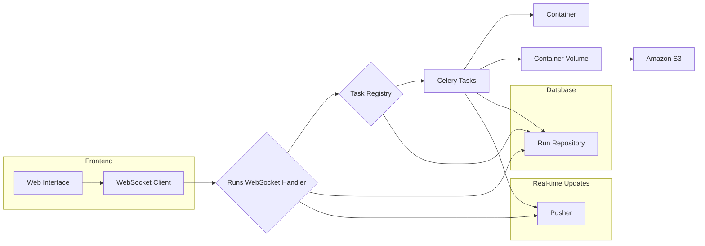

# Discovery API

The Discovery API is the engine behind a powerful, scalable platform built for automating security assessments. It combines the efficiency of Docker, the speed of asynchronous tasks, and real-time communication to streamline your security workflow.

## Highlights

* **Effortless Tool Integration:** Easily incorporate your favorite security tools – expand your arsenal with minimal effort.
* **Blazing Fast Performance:** Asynchronous tasks and a distributed architecture deliver speed and scalability for demanding assessments.
* **Real-Time Visibility:**  Stay informed with real-time updates on run progress, results, and potential errors - no more waiting in the dark.
* **Security First:** Containerized execution ensures consistent and secure tool environments, safeguarding your systems.

## Architecture



* **API Endpoints:** Exposed via FastAPI, allowing for easy interaction and integration.
* **Repository Pattern:** Streamlines data access for various models (runs, tools, etc.)
* **Task Registry:** Enables dynamic task invocation based on registered tool names.
* **Celery for Asynchronous Execution:** Celery manages tasks in the background, ensuring speed and responsiveness.
* **WebSockets and Pusher for Real-Time Communication:** Stay updated instantly with WebSockets and Pusher.
* **S3 for Volume Persistence:** Securely store assessment outputs and logs in S3 buckets.

## Get Started in Minutes

**1.  Set Up Your Environment:**

   - Create a `.env` file with your database, Docker, Pusher, and S3 configurations (see `discovery/core/config.py` for options). 

**2.  Run the API:**

   ```bash
   poetry install
   poetry run uvicorn discovery.app:app --reload  
   ```
   Or, run: `nx run api:dev`

**3.  Integrate Your Tools:**

   - Create a Celery task (`discovery/runs/tasks/my_tool.py`)
   - Inherit from `discovery.runs.run.Run` and implement the required methods.
   - Manage containers and volumes with  `discovery.containers.container.Container` and `discovery.containers.volume.ContainerVolume`.
   - Register your task in `discovery.runs.registry.Registry.tasks`.

**4.  Explore the API:**

   - Use the `/runs` endpoints to create and manage assessments.
   - Connect to `/runs/ws` for real-time updates via WebSockets.
   - Subscribe to the "runs" channel on Pusher to listen for events.

## Contribute! 🤝

We encourage you to contribute to Discovery API! Whether you're fixing bugs, adding features, or improving documentation, your contributions are valuable. Check out our contribution guidelines for details.
